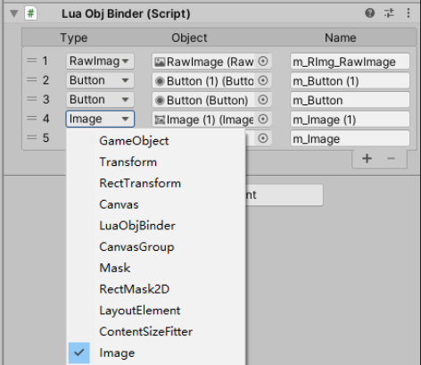

# LuaObjBinder
一个绑定UGUI节点对象到toLua的组件
### 关于UGUI绑定节点对象到toLua
以前在Lua端获取UGUI节点总是通过在Lua端调用C# Find("xxx"):GetComponent("xxx")的做法。写多了之后会发现Lua这边的UI代码中总是有一坨类似这样的传递UI节点路径获取组件的代码，写起来很麻烦，总是要去对照Prefab结构，并且会多次调用C#接口，多次传递字符串，可能还会产生一些临时userdata。一直想要一种方式能够替换这种做法，干掉这一坨字符串，后来与Lua群里的同学讨论，得出这样一种做法。

***挂载一个绑定组件，通过拖拽绑定的方式获得节点对象，在C#端构建Lua table，将节点对象Push到table中并传回Lua。***
主要的问题是在C#端开的是Object类型的List，挂载的时候无法明确区分组件类型，这个可以通过重写Inspect编辑器，在绑定的时候选好对应的组件类型，并且可以同时指定一个在Lua端访问的字段名。
主要代码：

构建一个LuaObj结构，包含一个Object对象和字段名，这个字段名实际只在编辑器下有用，可以给它设上UNITY_EDITOR宏，这样运行时就可以少一个字符串，不过在制作的时候这个字段的内容会被序列化到prefab上，运行时相当于是个无效内容，考虑到留着这个字段也许以后用得上，也没啥其它较好的存储办法，我就给它留在了代码里。

重写Inspector编辑器，开一个组件类型的列表，作为一个枚举列表放到Inspector上，用来挂载对象的时候可以选择需要的对象类型，赋值到上面的m_LuaObjs列表中。
Inspector枚举列表：

可以在挂载的时候选择需要的对象类型。

传递到Lua端的方式也很简单，直接调toLua的接口创建Table（其它Lua框架的话应该也有对应接口在C#端创建Table吧），把节点对象全塞进去，然后以LuaTable的形式返回到lua，也可以在UI资源加载的回调函数里面直接带回Lua。
**注意此处并没有用上面结构中的name作为key，而是以序号Index的形式构建了一个数组，name字段只在编辑器下有用。**
上面结构中的name会另外写一个编辑器工具，生成一个Name与Index映射表，大概像这样：
	
结合一个代码自动生成工具，构建UI的时候自动生成这一块代码。
Lua端拿到C#传递过来的对象数组之后，可以直接存储整个table，无需拆解，然后给UI类重写一个__Index元方法，按照映射表中的Index获取对象：

这样UI类中实际使用的时候就可以self.xxx的方式访问C#对象了，并且在释放的时候也只需要将这个数组table置为nil即可。
